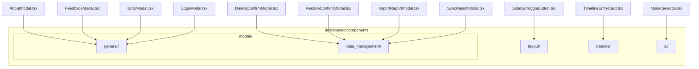

# Components Refactoring Plan

This document outlines the refactoring plan for cleaning up the `desktop/src/components/` directory. Currently, it contains 12 files (which exceeds the 10-file limit). The proposed structure groups components logically into descriptive subfolders, keeping the workspace transparent and clean for both human developers and AI assistants.

## File Cleanup
* Remove the redundant backup file `desktop/src/components/_Sidebar.tsx.bak` (which is already tracked in Git history).

## Proposed Target Directory Structure
All components in the root of `desktop/src/components/` will be moved into specialized subdirectories based on their function:

---

## Required File Moves and Import Updates

Below are the list of files to move and the relative path changes required for imports:

### 1. `AboutModal.tsx`
* **Old Path:** `desktop/src/components/AboutModal.tsx`
* **New Path:** `desktop/src/components/modals/general/AboutModal.tsx`
* **Internal Path Adjustments:**
  * `import { AboutAppTab } from "./about/AboutAppTab"` $\rightarrow$ `"../../about/AboutAppTab"`
  * `import { AboutMeTab } from "./about/AboutMeTab"` $\rightarrow$ `"../../about/AboutMeTab"`
  * `import { HonorSystemDialog } from "./about/HonorSystemDialog"` $\rightarrow$ `"../../about/HonorSystemDialog"`
* **Consumer Update:**
  * `desktop/src/App.tsx`: `import { AboutModal } from "./components/AboutModal"` $\rightarrow$ `"./components/modals/general/AboutModal"`

### 2. `FeedbackModal.tsx`
* **Old Path:** `desktop/src/components/FeedbackModal.tsx`
* **New Path:** `desktop/src/components/modals/general/FeedbackModal.tsx`
* **Consumer Update:**
  * `desktop/src/App.tsx`: `import { FeedbackModal } from "./components/FeedbackModal"` $\rightarrow$ `"./components/modals/general/FeedbackModal"`

### 3. `ErrorModal.tsx`
* **Old Path:** `desktop/src/components/ErrorModal.tsx`
* **New Path:** `desktop/src/components/modals/general/ErrorModal.tsx`
* **Consumer Update:**
  * `desktop/src/App.tsx`: `import { ErrorModal } from "./components/ErrorModal"` $\rightarrow$ `"./components/modals/general/ErrorModal"`

### 4. `LogoModal.tsx`
* **Old Path:** `desktop/src/components/LogoModal.tsx`
* **New Path:** `desktop/src/components/modals/general/LogoModal.tsx`
* **Internal Path Adjustments:**
  * `import { useAppStore } from "../store/useAppStore"` $\rightarrow$ `"../../../store/useAppStore"`
* **Consumer Update:**
  * `desktop/src/components/sidebar/SidebarBrandHeader.tsx`: `import { LogoModal } from "../LogoModal"` $\rightarrow$ `"../modals/general/LogoModal"`

### 5. `DeleteConfirmModal.tsx`
* **Old Path:** `desktop/src/components/DeleteConfirmModal.tsx`
* **New Path:** `desktop/src/components/modals/data_management/DeleteConfirmModal.tsx`
* **Internal Path Adjustments:**
  * `import { formatToDDMMYY } from "../lib/dateUtils"` $\rightarrow$ `"../../../lib/dateUtils"`
* **Consumer Updates:**
  * `desktop/src/views/timeline/TimelineView.tsx`: `import { DeleteConfirmModal } from "../../components/DeleteConfirmModal"` $\rightarrow$ `"../../components/modals/data_management/DeleteConfirmModal"`
  * `desktop/src/views/search/SearchView.tsx`: `import { DeleteConfirmModal } from "../../components/DeleteConfirmModal"` $\rightarrow$ `"../../components/modals/data_management/DeleteConfirmModal"`

### 6. `RestoreConfirmModal.tsx`
* **Old Path:** `desktop/src/components/RestoreConfirmModal.tsx`
* **New Path:** `desktop/src/components/modals/data_management/RestoreConfirmModal.tsx`
* **Consumer Update:**
  * `desktop/src/components/settings/IdentitySection.tsx`: `import { RestoreConfirmModal } from "../RestoreConfirmModal"` $\rightarrow$ `"../modals/data_management/RestoreConfirmModal"`

### 7. `ImportReportModal.tsx`
* **Old Path:** `desktop/src/components/ImportReportModal.tsx`
* **New Path:** `desktop/src/components/modals/data_management/ImportReportModal.tsx`
* **Internal Path Adjustments:**
  * `import { formatToDDMMYY } from "../lib/dateUtils"` $\rightarrow$ `"../../../lib/dateUtils"`
  * `import type { ImportReport } from "../store/domains/uiSlice"` $\rightarrow$ `"../../../store/domains/uiSlice"`
* **Consumer Update:**
  * `desktop/src/App.tsx`: `import { ImportReportModal } from "./components/ImportReportModal"` $\rightarrow$ `"./components/modals/data_management/ImportReportModal"`

### 8. `SyncResultModal.tsx`
* **Old Path:** `desktop/src/components/SyncResultModal.tsx`
* **New Path:** `desktop/src/components/modals/data_management/SyncResultModal.tsx`
* **Internal Path Adjustments:**
  * `import { formatToDDMMYY } from "../lib/dateUtils"` $\rightarrow$ `"../../../lib/dateUtils"`
  * `import { useAppStore } from "../store/useAppStore"` $\rightarrow$ `"../../../store/useAppStore"`
* **Consumer Update:**
  * `desktop/src/App.tsx`: `import { SyncResultModal } from "./components/SyncResultModal"` $\rightarrow$ `"./components/modals/data_management/SyncResultModal"`

### 9. `SidebarToggleButton.tsx`
* **Old Path:** `desktop/src/components/SidebarToggleButton.tsx`
* **New Path:** `desktop/src/components/layout/SidebarToggleButton.tsx`
* **Consumer Updates:**
  * `desktop/src/views/timeline/TimelineHeader.tsx`: `import { SidebarToggleButton } from "../../components/SidebarToggleButton"` $\rightarrow$ `"../../components/layout/SidebarToggleButton"`
  * `desktop/src/views/SettingsView.tsx`: `import { SidebarToggleButton } from "../components/SidebarToggleButton"` $\rightarrow$ `"../components/layout/SidebarToggleButton"`
  * `desktop/src/views/ReflectionView.tsx`: `import { SidebarToggleButton } from "../components/SidebarToggleButton"` $\rightarrow$ `"../components/layout/SidebarToggleButton"`
  * `desktop/src/views/journal/JournalEditorHeader.tsx`: `import { SidebarToggleButton } from "../../components/SidebarToggleButton"` $\rightarrow$ `"../../components/layout/SidebarToggleButton"`
  * `desktop/src/components/search/SearchHeader.tsx`: `import { SidebarToggleButton } from "../SidebarToggleButton"` $\rightarrow$ `"../layout/SidebarToggleButton"`
  * `desktop/src/components/common/SelectionToolbar.tsx`: `import { SidebarToggleButton } from "../SidebarToggleButton"` $\rightarrow$ `"../layout/SidebarToggleButton"`
  * `desktop/src/components/chat/ChatHeader.tsx`: `import { SidebarToggleButton } from "../SidebarToggleButton"` $\rightarrow$ `"../layout/SidebarToggleButton"`

### 10. `TimelineEntryCard.tsx`
* **Old Path:** `desktop/src/components/TimelineEntryCard.tsx`
* **New Path:** `desktop/src/components/timeline/TimelineEntryCard.tsx`
* **Internal Path Adjustments:**
  * `import { JournalEntryMetadata, ViewType } from "../types"` $\rightarrow$ `"../../types"`
* **Consumer Update:**
  * `desktop/src/views/timeline/TimelineEntryList.tsx`: `import { TimelineEntryCard } from "../../components/TimelineEntryCard"` $\rightarrow$ `"../../components/timeline/TimelineEntryCard"`

### 11. `ModelSelector.tsx`
* **Old Path:** `desktop/src/components/ModelSelector.tsx`
* **New Path:** `desktop/src/components/ai/ModelSelector.tsx`
* **Internal Path Adjustments:**
  * `import { OllamaModelInfo } from "../services/ollama"` $\rightarrow$ `"../../services/ollama"`
* **Consumer Updates:**
  * `desktop/src/views/ReflectionView.tsx`: `import { ModelSelector } from "../components/ModelSelector"` $\rightarrow$ `"../components/ai/ModelSelector"`
  * `desktop/src/components/search/SearchHeader.tsx`: `import { ModelSelector } from "../ModelSelector"` $\rightarrow$ `"../ai/ModelSelector"`
  * `desktop/src/components/chat/ChatHeader.tsx`: `import { ModelSelector } from "../ModelSelector"` $\rightarrow$ `"../ai/ModelSelector"`
